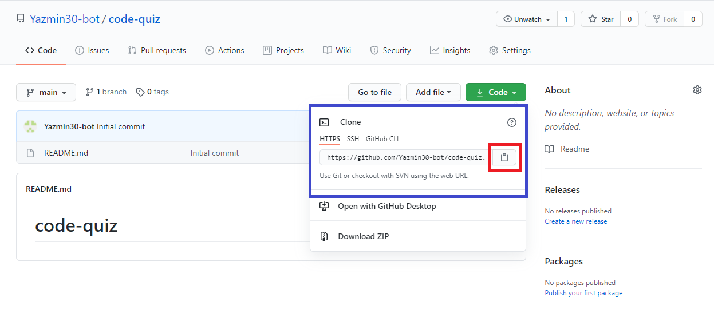
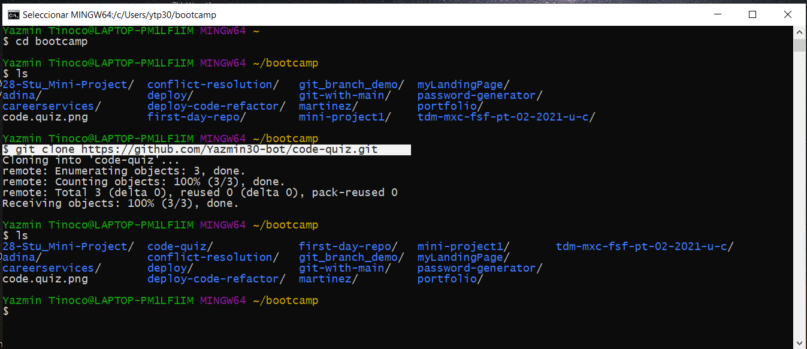
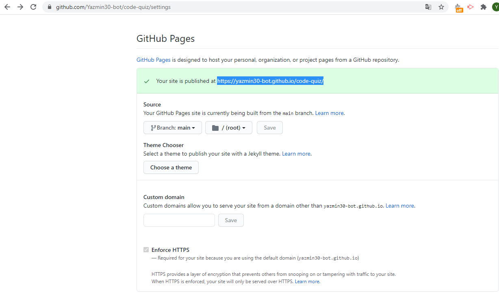
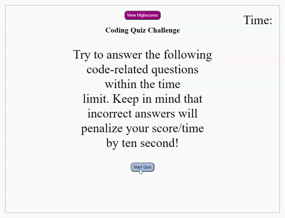

# Code Quiz
**Displays a timed coding quiz with multiple-choice questions.**
\
&nbsp;
## Description
At some point in your journey to become a full-stack web developer, you’ll likely be asked to complete a coding assessment&mdash;perhaps as part of an interview process. A typical coding assessment includes both multiple-choice questions and interactive coding challenges. 

To help familiarize you with these tests and allow you to use the skills covered in this unit, this week’s homework invites you to build a timed coding quiz with multiple-choice questions. This app will run in the browser and will feature dynamically updated HTML and CSS powered by JavaScript code that you write. It will have a clean, polished, and responsive user interface. 

## Requirements
This proyect  requires no modules outside of the core.

## Installation
* Go to the following link [https://github.com/Yazmin30-bot/code-quiz](https://github.com/Yazmin30-bot/code-quiz/) and clone the link 

* Go to Git-bash and page the github's with the following code `$ git clone https://github.com/Yazmin30-bot/code-quiz.git ` 

### Note

* If you use the web page link from the github make sure to add the final index.html
https://yazmin30-bot.github.io/code-quiz/index.html

## Mock-Up

The following animation demonstrates the application functionality:

## Build with 
* [Javascript](https://www.javascript.com/) - `Javascript`
* [CSS](https://www.w3schools.com/css/) - `CSS`
\
&nbsp;

## Links
* The URL of the deployed application.
[https://yazmin30-bot.github.io/code-quiz/index.html](https://yazmin30-bot.github.io/code-quiz/index.html)

* The URL of the GitHub repository
[https://github.com/Yazmin30-bot/code-quiz/](https://github.com/Yazmin30-bot/code-quiz/)

## Authors 
* **`Yazmin Tinoco`**   - [Yazmin30-bot](https://github.com/Yazmin30-bot/)
---
permalink: /index.html
---
